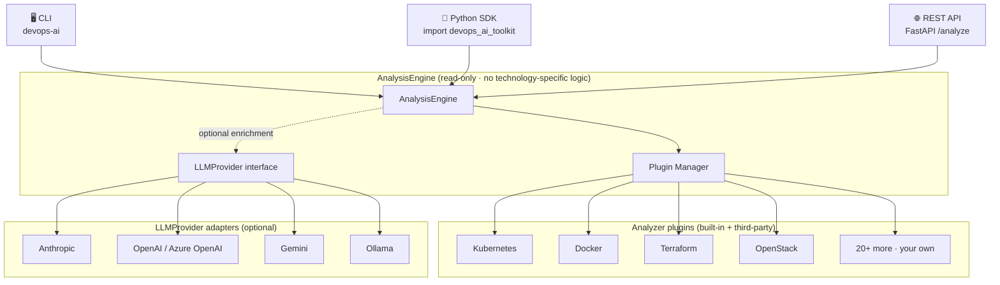

<div align="center">


# DevOps AI Toolkit

**AI for DevOps that never touches your infrastructure — read-only troubleshooting for logs, YAML, Terraform, Kubernetes, OpenStack & more.**

[](https://github.com/devopsaitoolkit/devops-ai-toolkit/actions)
[](https://pypi.org/project/devops-ai-toolkit/)
[](https://www.python.org/downloads/)
[](LICENSE)
[](https://github.com/astral-sh/ruff)
[](https://docs.astral.sh/ruff/)
[](https://github.com/devopsaitoolkit/devops-ai-toolkit/stargazers)

</div>

**DevOps AI Toolkit** is AI-powered, **read-only** DevOps troubleshooting for logs, YAML, Terraform, Kubernetes, OpenStack and **19+ technologies**. It is built around **one engine, three interfaces** — a CLI, a Python SDK, and a FastAPI REST API that all call the same `AnalysisEngine`. The core is **offline-first and deterministic** (a packaged knowledge base of error signatures, **no API key required**), with **optional LLM enrichment** behind a vendor-agnostic provider adapter. Whether you do SRE, platform engineering, incident response, or infrastructure as code, you get ranked root causes and safe, copy-pasteable diagnostics — without ever running a command against production.

---

## 🎬 Demo


<sub>*Animated terminal example — `devops-ai analyze` ranking root causes from a real log.*</sub>

```text
$ devops-ai analyze sample_logs/kubernetes_crashloopbackoff.log

╭───────────────────────────── Analysis ──────────────────────────────╮
│ Summary                                                              │
│ Most likely cause (88% confidence): Container exits immediately on   │
│ startup. 3 candidate cause(s) identified for kubernetes.             │
╰──────────────────────────────────────────────────────────────────────╯

Likely Causes
 1. [88%] Application crashes on boot (config/secret)
        Container command exits non-zero before readiness; pod is restarted
        repeatedly until it enters CrashLoopBackOff.
 2. [71%] Missing or misconfigured liveness/readiness probe
        Probe fails during startup and the kubelet kills the container.
 3. [54%] OOMKilled — memory limit too low
        Container exceeds its memory limit and is terminated (exit 137).

Diagnostic Commands (read-only)
 $ kubectl describe pod <pod> -n <namespace>
        Shows the last state, exit code and restart count.
 $ kubectl logs <pod> -n <namespace> --previous
        Reads logs from the previous, crashed container instance.
 $ kubectl get events -n <namespace> --sort-by=.lastTimestamp
        Surfaces OOMKills, image-pull errors and probe failures.

Suggested Fixes
 • Fix the failing startup command or mount the missing ConfigMap/Secret.
 • Loosen or remove the startup probe until the app boots cleanly.
 • Raise resources.limits.memory or reduce the app's memory footprint.

References · Kubernetes docs: Debug Running Pods
```

---

## 📑 Table of Contents

- [✨ Features](#-features)
- [🚀 Quick Start](#-quick-start)
- [🏛 Architecture](#-architecture)
- [🖥 CLI](#-cli)
- [🐍 Python SDK](#-python-sdk)
- [🌐 REST API](#-rest-api)
- [🤖 AI Providers](#-ai-providers)
- [🧰 Supported Technologies](#-supported-technologies)
- [🗺 Roadmap](#-roadmap)
- [📚 Documentation](#-documentation)
- [🤝 Contributing](#-contributing)
- [💬 Community](#-community)
- [❓ FAQ](#-faq)
- [🔒 Security](#-security)
- [📄 License](#-license)
- [🙏 Acknowledgements](#-acknowledgements)

---

## ✨ Features

- 🔒 **Read-only & safe by design** — inspects text and emits guidance. It never executes commands, mutates files, or touches infrastructure.
- 🧠 **80+ error signatures across 19 technologies** — a curated knowledge base for Kubernetes, Terraform, Docker, OpenStack, Linux and more.
- 📴 **Offline-first & deterministic** — the packaged knowledge base does the analysis with **no API key needed**; identical results every run.
- 🤖 **Optional LLM enrichment** — Anthropic, OpenAI, Gemini, or Ollama add narrative through a single **vendor-agnostic adapter**; the core never imports a vendor SDK.
- 🧩 **One engine, three interfaces** — **CLI + Python SDK + FastAPI REST API** share a single `AnalysisEngine`, so behaviour is identical everywhere.
- 🎯 **Ranked root causes with confidence** — candidate causes are scored and sorted, each with a `confidence_percent`.
- 🩺 **Read-only diagnostic commands** — every suggestion comes with an explanation and expected output, so you stay in control.
- ✅ **Manifest validation** — validate YAML, Kubernetes and Terraform documents without applying anything.
- 🧾 **Structured JSON output** — `--json` on any command for pipelines, dashboards and incident-response automation.
- 🛠 **Typed, tested & CI'd** — strict `mypy`, `ruff` lint, `pytest` coverage, Python 3.12+.

---

## 🚀 Quick Start

### Installation

```bash
# Core CLI + SDK (offline, deterministic, no API key)
pip install devops-ai-toolkit

# With the REST API server (FastAPI + Uvicorn)
pip install 'devops-ai-toolkit[api]'
```

Develop from source with [uv](https://docs.astral.sh/uv/):

```bash
git clone https://github.com/devopsaitoolkit/devops-ai-toolkit.git
cd devops-ai-toolkit
uv sync --extra all          # installs the api + dev extras
uv run devops-ai version
```

### 30-second CLI

```bash
# Analyze a log, manifest or command output
devops-ai analyze sample_logs/kubernetes_crashloopbackoff.log

# Explain a known error from the knowledge base
devops-ai explain CrashLoopBackOff

# Pipe anything in via stdin
kubectl logs my-pod | devops-ai analyze -
```

### Python SDK

```python
from devops_ai_toolkit import AnalysisEngine

result = AnalysisEngine().analyze_file("nova.log")
print(result.summary)
for cause in result.root_causes:
    print(f"[{cause.confidence_percent}%] {cause.title}")
```

### REST API

```bash
# Start the server (needs the [api] extra)
devops-ai serve --host 127.0.0.1 --port 8000

# In another shell — analyze a log over HTTP
curl -s http://127.0.0.1:8000/analyze/log \
  -H 'Content-Type: application/json' \
  -d '{"content": "Back-off restarting failed container", "enrich": false}'
```

Interactive Swagger UI is auto-generated at **http://127.0.0.1:8000/docs**.

---

## 🏛 Architecture



The toolkit follows **clean, plugin-based architecture**: all orchestration lives in a single `AnalysisEngine`, and the CLI, SDK and REST API are thin adapters that only handle I/O and rendering. The engine contains **no technology-specific logic** — every technology is an independent **plugin** discovered by the `PluginManager` (built-ins by module discovery, third-party plugins via entry points), so you add support for new technologies without touching the core. LLM providers are themselves a plugin point behind the vendor-agnostic `LLMProvider` interface, consulted **only** when you opt into enrichment. The **read-only guarantee** is structural: the engine inspects text and returns guidance — it never executes commands, mutates files, or touches your infrastructure.

---

## 🔌 Plugin Architecture

Every supported technology is a self-contained plugin implementing the `AnalyzerPlugin` interface. The core never changes when you add one — the engine discovers built-in plugins automatically and third-party plugins via the `devops_ai_toolkit.plugins` entry point.

```bash
# See everything the engine discovered (built-in + installed third-party)
devops-ai plugins list
devops-ai plugins info kubernetes
devops-ai plugins doctor        # health + compatibility report
devops-ai plugins disable redis # toggles are persisted

# Scaffold your own installable plugin in seconds
devops-ai create-plugin mycompany-plugin
cd mycompany-plugin && pip install -e .
devops-ai plugins list          # your plugin is now auto-discovered
```

Plugins ship marketplace-ready metadata (`name`, `version`, `author`, `license`, `minimum_core_version`, `tags`, `supported_platforms`, `repository`, …) and support enterprise needs — private/internal plugins, signing (`signed`/`checksum`), version pinning, offline install, and compatibility validation. See the [Plugin Guide](docs/plugins.md), [Plugin Development](docs/plugin-development.md), [Marketplace design](docs/plugin-marketplace.md) and [Enterprise plugins](docs/enterprise-plugins.md).

---

## 🖥 CLI

The `devops-ai` command is a thin Typer wrapper over the engine.

| Command | What it does |
| --- | --- |
| `analyze [SOURCE]` | Analyze a log, manifest, Terraform file or command output (`-` = stdin). |
| `explain ERROR` | Explain a known error (e.g. `CrashLoopBackOff`) from the knowledge base. |
| `validate [SOURCE]` | Validate a YAML / Kubernetes / Terraform document (read-only). |
| `list` | List the error signatures the toolkit knows about. |
| `serve` | Run the FastAPI REST API (requires the `api` extra). |
| `version` | Print the installed version. |

```bash
# Analyze with a technology hint and machine-readable output
devops-ai analyze terraform-plan.txt --tech terraform --json

# Add an LLM narrative on top of the deterministic result
devops-ai analyze nova.log --enrich --provider anthropic

# Explain an error and emit JSON
devops-ai explain ImagePullBackOff --json

# Validate a manifest from stdin
cat deployment.yaml | devops-ai validate -

# List signatures, filtered to one technology
devops-ai list --tech kubernetes

# Run the REST API
devops-ai serve --host 0.0.0.0 --port 8000
```

> `analyze` exits `0` when a signature matches and `1` otherwise; `validate` exits `0` only when the document is valid — handy for CI gates.

---

## 🐍 Python SDK

```python
from devops_ai_toolkit import AnalysisEngine
from devops_ai_toolkit.models import Technology

engine = AnalysisEngine()

# Analyze a file from disk (the only filesystem read the engine performs)
result = engine.analyze_file("nova.log")

# Analyze a raw string, with hints
result = engine.analyze_text(log_text, technology=Technology.KUBERNETES, filename="pod.log")

# Source-kind-aware helpers
yaml_result = engine.analyze_yaml(open("deployment.yaml").read())
tf_result = engine.analyze_terraform(open("plan.txt").read())

# Explain a known error
explanation = engine.explain_error("CrashLoopBackOff")

# Validate a manifest (read-only)
validation = engine.validate_manifest(open("deployment.yaml").read(), filename="deployment.yaml")
```

Work with the typed result fields:

```python
print(result.summary)

for cause in result.root_causes:
    print(f"[{cause.confidence_percent}%] {cause.title} — {cause.description}")

for cmd in result.diagnostic_commands:
    print(cmd.command)

# Serialize for pipelines / storage
from devops_ai_toolkit.output import to_json
print(to_json(result))
```

Every `AnalysisResult` carries `summary`, `technology`, `root_causes` (each with `confidence` and `confidence_percent`), `diagnostic_commands`, `suggested_fixes`, `references`, `warnings`, `best_practices` and `prevention`.

---

## 🌐 REST API

Start it with `devops-ai serve` (after `pip install 'devops-ai-toolkit[api]'`). Every route delegates to the same shared engine and marshals JSON only.

| Method | Endpoint | Purpose |
| --- | --- | --- |
| `GET` | `/health` | Liveness/readiness with signature count and provider status. |
| `GET` | `/version` | Running version. |
| `POST` | `/analyze/log` | Analyze a log or command output. |
| `POST` | `/analyze/yaml` | Analyze a YAML / Kubernetes manifest. |
| `POST` | `/analyze/terraform` | Analyze Terraform config or plan/apply output. |
| `POST` | `/explain` | Explain a known error from the knowledge base. |
| `POST` | `/validate` | Validate a YAML / Kubernetes / Terraform document. |

```bash
# Health check
curl -s http://127.0.0.1:8000/health

# Analyze Terraform plan output
curl -s http://127.0.0.1:8000/analyze/terraform \
  -H 'Content-Type: application/json' \
  -d '{"content": "Error: Provider produced inconsistent final plan", "enrich": false}'

# Explain an error
curl -s http://127.0.0.1:8000/explain \
  -H 'Content-Type: application/json' \
  -d '{"error": "OOMKilled"}'
```

Interactive **Swagger UI** lives at `/docs` and ReDoc at `/redoc`.

---

## 🤖 AI Providers

The toolkit is **offline by default** — the deterministic knowledge base needs **no API key**. To add an LLM narrative, pass `--enrich` (CLI) or `enrich=true` (SDK/API) and configure one provider via environment variables. The core depends only on the `AIProvider` protocol, so providers are pluggable adapters.

| Provider | Adapter | Notes |
| --- | --- | --- |
| **(none)** | `NullProvider` | Default. Fully offline, deterministic, no key required. |
| **Anthropic** | `AnthropicProvider` | Claude models for high-quality enrichment. |
| **OpenAI** | `OpenAIProvider` | GPT models via the OpenAI API. |
| **Gemini** | `GeminiProvider` | Google Gemini models. |
| **Ollama** | `OllamaProvider` | Local/self-hosted models — keep everything on-prem. |

```bash
# Example: enable Anthropic enrichment
export ANTHROPIC_API_KEY="sk-ant-..."
devops-ai analyze nova.log --enrich --provider anthropic
```

If enrichment is requested but no provider is configured, the engine quietly returns the deterministic result with a low-severity warning — analysis never breaks because of a missing key or network call.

---

## 🧰 Supported Technologies

The packaged knowledge base spans **19+ technologies** across containers, orchestration, infrastructure as code, observability, data stores and cloud:

| | | | |
| --- | --- | --- | --- |
| 🐳 Docker | 🧱 Docker Compose | ☸️ Kubernetes | 🔴 OpenShift |
| 🌍 Terraform | 📜 Ansible | ☁️ OpenStack | 🐧 Linux |
| ⚙️ systemd | 🦊 GitLab CI | 📈 Prometheus | 📊 Grafana |
| 🐰 RabbitMQ | 🧠 Redis | 🌐 NGINX | 🪶 Apache |
| 🐘 PostgreSQL | 🐬 MySQL | 🪸 Ceph | 🟧 AWS |
| 🔷 Azure | 🟦 GCP | | |

Run `devops-ai list` to see every signature, or `devops-ai list --tech kubernetes` to filter.

---

## 🗺 Roadmap

All current and future interfaces reuse the same `AnalysisEngine`, so each one inherits the read-only guarantee and identical behaviour for free.

- [x] CLI (`devops-ai`)
- [x] Python SDK (`AnalysisEngine`)
- [x] REST API (FastAPI)
- [x] Plugin architecture (built-in + third-party, `create-plugin`)
- [x] Multi-provider LLM adapters (Anthropic, OpenAI, Azure OpenAI, Gemini, Ollama)
- [ ] Plugin marketplace / registry
- [ ] Web UI
- [ ] VS Code extension
- [ ] GitHub Action
- [ ] MCP server
- [ ] Desktop app · Enterprise edition

See [`docs/roadmap.md`](docs/roadmap.md) and the planned-interface design notes in [`docs/`](docs/).

---

## 📚 Documentation

Full docs live in [`docs/`](docs/README.md):

- [Getting started](docs/getting-started.md)
- [Architecture](docs/architecture.md)
- [SDK guide](docs/sdk-guide.md)
- [REST API guide](docs/rest-api-guide.md)
- [Knowledge base](docs/knowledge-base.md)
- [Plugin guide](docs/plugins.md) · [Plugin development](docs/plugin-development.md) · [Enterprise plugins](docs/enterprise-plugins.md)
- [AI / LLM providers](docs/llm-providers.md)
- [Contributing](docs/contributing.md)

More DevOps troubleshooting guides are on the [blog](https://devopsaitoolkit.com/blog), and there's a hosted [AI Incident Response Assistant](https://devopsaitoolkit.com/dashboard/incident-response) if you'd rather not self-host.

---

## 🤝 Contributing

Contributions are welcome — see [CONTRIBUTING.md](CONTRIBUTING.md). The highest-leverage way to help is **adding a knowledge-base signature**: drop a new entry into the relevant YAML file under [`src/devops_ai_toolkit/knowledge/data/`](src/devops_ai_toolkit/knowledge/data/) (one file per technology, e.g. `kubernetes.yaml`), with a title, summary, root causes, read-only diagnostic commands, suggested fixes and references. See [`docs/knowledge-base.md`](docs/knowledge-base.md) for the schema and a worked example. No code change is needed — signatures are loaded automatically.

---

## 💬 Community

- ⭐ Star the repo to follow along and help others discover it.
- 🐛 File issues and ideas on [GitHub Issues](https://github.com/devopsaitoolkit/devops-ai-toolkit/issues).
- 📰 Subscribe to the [DevOps AI newsletter](https://devopsaitoolkit.com/newsletter) for SRE, platform engineering and incident-response tips.

---

## ❓ FAQ

**Does it run commands against my cluster or infrastructure?**
No. The toolkit is **read-only** by design. It inspects text and emits guidance — diagnostic commands are printed for *you* to run, never executed by the tool.

**Do I need an API key?**
No. The core is offline-first and deterministic with no key required. LLM enrichment is strictly optional.

**Which LLMs are supported?**
Anthropic, OpenAI, Gemini and Ollama, all behind a vendor-agnostic adapter. Add `--enrich` and configure one with an environment variable.

**Is my data sent anywhere?**
Not by default. Without `--enrich` nothing leaves your machine. With enrichment, only the analysis summary and a truncated input are sent to the provider you chose (use Ollama to stay fully local).

**Will the CLI, SDK and REST API give different answers?**
No. They all call the same `AnalysisEngine`, so results are identical across interfaces.

**What Python versions are supported?**
Python **3.12+**.

---

## 🔒 Security

Security is foundational: the engine is structurally read-only and never executes commands or mutates files. To report a vulnerability, please follow [SECURITY.md](SECURITY.md).

---

## 📄 License

Released under the **MIT License**. See [LICENSE](LICENSE).

---

## 🙏 Acknowledgements

Built on the shoulders of excellent open source: [Typer](https://typer.tiangolo.com/) and [Rich](https://github.com/Textualize/rich) for the CLI, [FastAPI](https://fastapi.tiangolo.com/) and [Uvicorn](https://www.uvicorn.org/) for the API, [Pydantic](https://docs.pydantic.dev/) for typed models, and [Ruff](https://docs.astral.sh/ruff/) + [mypy](https://mypy-lang.org/) for keeping the codebase honest. Thanks to the DevOps, SRE and platform-engineering community for the signatures and the war stories behind them.

<div align="center">
<sub>Built for engineers who'd rather debug than guess. ⭐ If this saved you a 2 a.m. page, star the repo.</sub>
</div>
