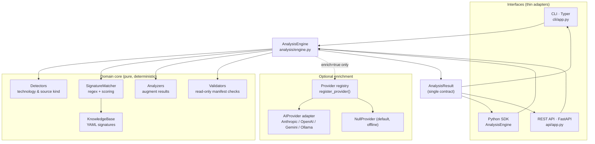

# Architecture

The toolkit follows a **clean / hexagonal architecture**. All business logic lives in one place —
the `AnalysisEngine` — and every interface (CLI, SDK, REST API) is a thin adapter over it. This
guarantees identical behaviour everywhere and keeps the code small and testable.

## The core principle: one engine, no duplicated logic

```
            ┌──────────┐   ┌──────────┐   ┌──────────┐
            │   CLI    │   │   SDK    │   │ REST API │     ← thin adapters (I/O only)
            │ (Typer)  │   │ (Python) │   │(FastAPI) │
            └────┬─────┘   └────┬─────┘   └────┬─────┘
                 └──────────────┼──────────────┘
                                ▼
                        ┌───────────────┐
                        │ AnalysisEngine│              ← the only place with logic
                        └───────┬───────┘
        ┌───────────────┬───────┼────────┬───────────────┐
        ▼               ▼       ▼        ▼               ▼
  SignatureMatcher  KnowledgeBase  Analyzers  Validators  AIProvider
  (regex/scoring)   (YAML data)    (augment)  (read-only) (optional, adapter)
```

- The CLI (`cli/app.py`) reads input and renders results — nothing else.
- The REST API (`api/app.py`) marshals JSON — every route delegates to one shared engine instance.
- The SDK *is* the engine: `from devops_ai_toolkit import AnalysisEngine`.

If you change behaviour, you change the engine, and all three interfaces update together.

## Mermaid: request flow



## The analysis pipeline

`AnalysisEngine.analyze()` runs these steps (all read-only):

1. **Truncate** the input to `max_input_chars` (default 200,000). See [Configuration](configuration.md).
2. **Detect** technology and source kind (overridable via hints).
3. **Match** the input against the knowledge base with `SignatureMatcher` (case-insensitive regex
   patterns, `any_of` / `all_of`, weighted scoring).
4. **Build** an `AnalysisResult`: blend each signature's match score with each cause's prior
   confidence, rank root causes, and de-duplicate commands/references/tips.
5. **Augment** via an optional source-kind/technology-specific analyzer.
6. **Enrich** (only if `enrich=True` *and* a provider is available) with an LLM narrative.

The result is a single `AnalysisResult` model — the same object serialized to JSON by the API,
rendered with Rich by the CLI, and returned to SDK callers. See [Output format](output-format.md).

## Package layout

| Package         | Responsibility                                                        |
|-----------------|-----------------------------------------------------------------------|
| `analysis/`     | The `AnalysisEngine` — the only place with business logic             |
| `models/`       | Pydantic models and enums (the stable data contracts)                 |
| `knowledge/`    | YAML signature data + loader (`KnowledgeBase`)                         |
| `detectors/`    | `SignatureMatcher` and matching/scoring                               |
| `analyzers/`    | Source-kind/technology augmenters that enrich a result                |
| `validators/`   | Read-only YAML / Kubernetes / Terraform validation                    |
| `parsers/`      | YAML-doc and Terraform parsing helpers                                 |
| `providers/`    | AI adapter `Protocol`, the registry, and per-vendor adapters          |
| `prompts/`      | Enrichment prompt templates                                           |
| `explainers/`   | `ErrorCatalog` over the knowledge base for `explain`/`list`           |
| `output/`       | Rich console rendering and JSON serialization                         |
| `cli/`          | Typer application (`devops-ai`)                                        |
| `api/`          | FastAPI application and request/response schemas                       |
| `utils/`        | Settings, logging, text helpers                                       |

## Design properties

- **Dependency inversion.** The engine depends on the `AIProvider` *protocol*, never a vendor SDK.
  Providers are resolved at runtime from a registry. See [AI providers](ai-providers.md).
- **Stateless engine.** The engine is a façade with injected collaborators (`knowledge_base`,
  `provider`, `settings`) — all overridable, which makes testing trivial. See the
  [Testing guide](testing-guide.md).
- **Additive contracts.** `AnalysisResult` is meant to grow only by addition, so the CLI, SDK, and
  API never drift apart.
- **Graceful degradation.** Unknown providers and enrichment failures fall back to deterministic
  results rather than raising.

For how to extend the knowledge base or add a provider, see the [Plugin guide](plugin-guide.md).
