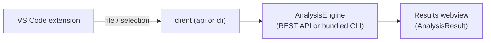

# VS Code extension (planned)

> **Status: planned / design note.** A future surface, not yet released. It would be a thin client
> over the [REST API](rest-api-guide.md) or a bundled [CLI](cli-guide.md) — no new analysis logic.

## Goal

Bring read-only analysis into the editor, where operators already read logs and edit manifests.
Right-click a log, a selection, or a manifest and get ranked root causes, read-only diagnostic
commands, and suggested fixes in a side panel.

## Proposed features

- **Analyze file / selection** — command-palette and context-menu actions that send the active
  file or selection to the engine.
- **Inline manifest validation** — run `validate` on YAML/Kubernetes/Terraform files and show
  issues as editor diagnostics (squiggles), using `ValidationIssue.line`/`path`.
- **Explain on hover/lookup** — select an error name (e.g. `CrashLoopBackOff`) and `explain` it.
- **Results panel** — a webview rendering the `AnalysisResult` sections; diagnostic commands are
  copy-only (never executed) to preserve the read-only guarantee. See [Security](security.md).
- **Terminal output capture** — analyze the last command's output.

## Proposed settings

| Setting                         | Description                                  |
|---------------------------------|----------------------------------------------|
| `devopsAi.mode`                 | `cli` (bundled) or `api` (remote endpoint)   |
| `devopsAi.apiUrl`               | REST API base URL when in `api` mode         |
| `devopsAi.enrich`               | Enable LLM enrichment                        |
| `devopsAi.provider`             | Provider name                                |

Provider keys come from the environment / OS keychain, never stored in settings. See
[Configuration](configuration.md).

## Architecture

Like every surface, it adapts I/O only — the [shared engine](architecture.md) does the work, so
results match the CLI, SDK, and API.

## Read-only by design

Suggested diagnostic commands are shown as copyable text and **never run** by the extension. Fixes
are presented as guidance/snippets the developer applies deliberately.

## Feedback

Interested? Open an issue (see [Contributing](contributing.md)) and follow
<https://devopsaitoolkit.com/newsletter>.
