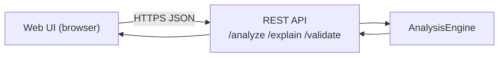

# Web UI (planned)

> **Status: planned / design note.** A future surface, not yet released. It would be a browser
> front-end over the [REST API](rest-api-guide.md) — no new analysis logic.

## Goal

A zero-install, paste-and-analyze experience for operators who'd rather not use the terminal: paste
a log or manifest, pick a technology (or let it auto-detect), and read the ranked root causes,
read-only diagnostic commands, and suggested fixes — plus a searchable view of the knowledge base.

## Proposed features

- **Analyze panel** — paste text, optional technology hint, optional enrichment toggle; renders the
  full `AnalysisResult` ([Output format](output-format.md)).
- **Explain lookup** — type an error name and get its catalog entry.
- **Validate panel** — paste a manifest and see issues with severities and line/path hints.
- **Catalog browser** — search and filter signatures by technology (backed by `list`).
- **Copy-only commands** — diagnostic commands are copyable but never executed, preserving the
  read-only guarantee. See [Security](security.md).

## Architecture

The UI is a pure client of the existing API. Because it calls the [shared engine](architecture.md),
results match the CLI, SDK, API, and every other surface.

## Deployment notes

- Pair it with the [REST API](rest-api-guide.md). The API ships no auth, so place both behind your
  own authentication and TLS if exposed beyond localhost.
- Offline by default; enrichment is opt-in and configured server-side. See
  [Configuration](configuration.md).

## Already available, hosted

If you want a hosted, managed experience today, the
[AI incident-response assistant](https://devopsaitoolkit.com/dashboard/incident-response) provides
one — and the self-hosted Web UI above is the planned open-source counterpart.

## Feedback

Open an issue (see [Contributing](contributing.md)) or follow
<https://devopsaitoolkit.com/blog> for progress.
